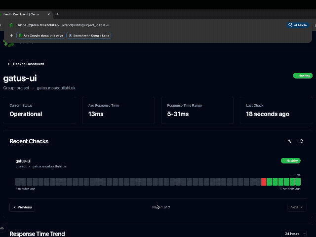
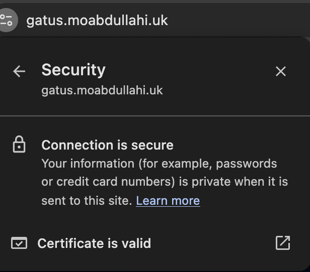
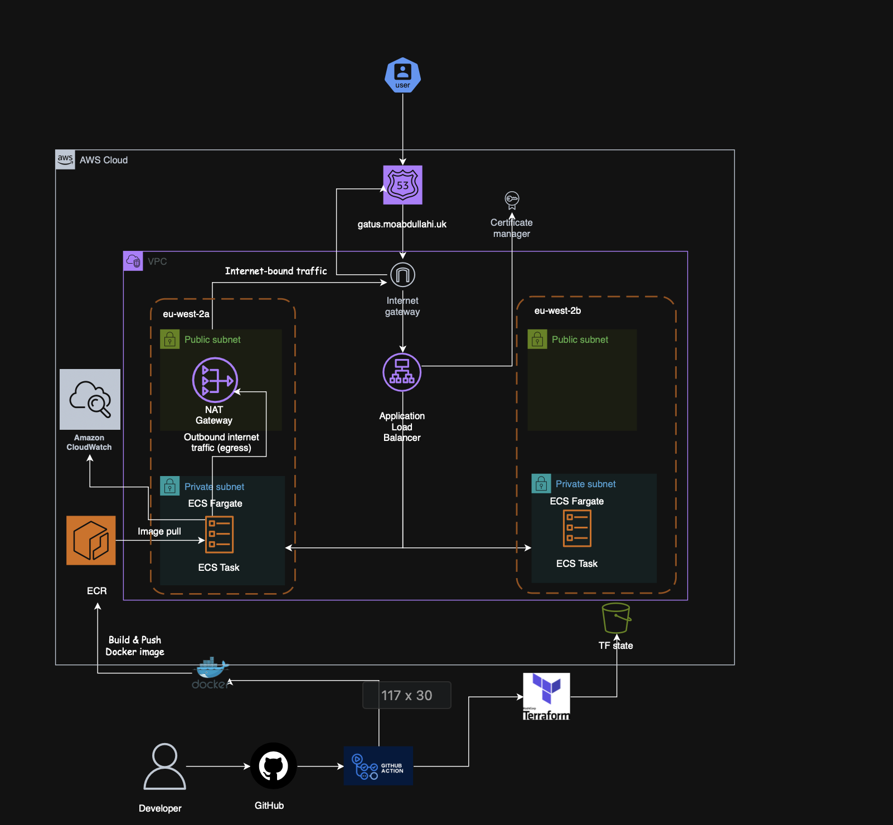
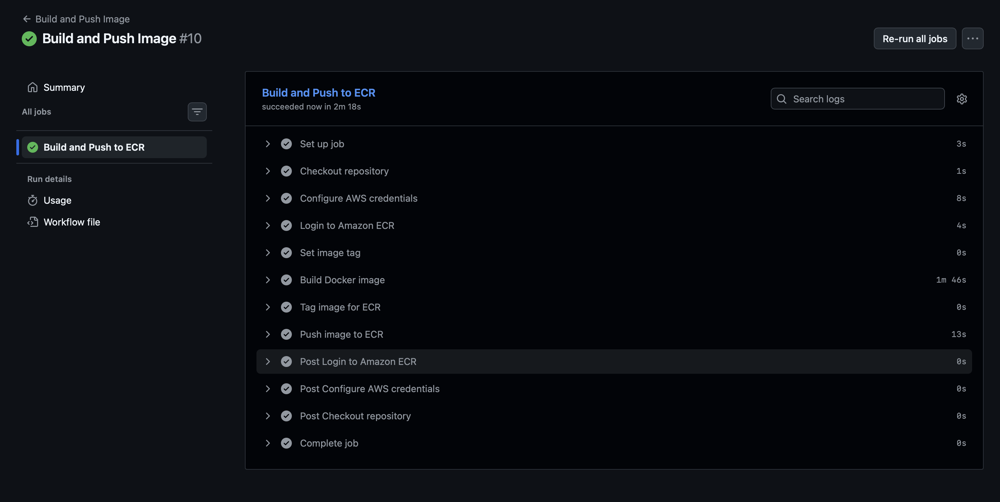
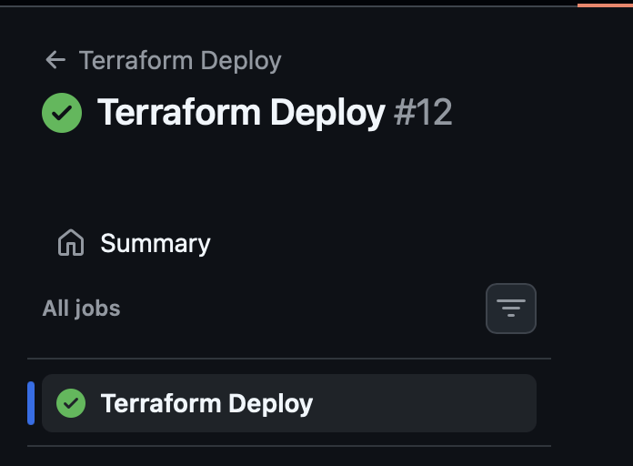
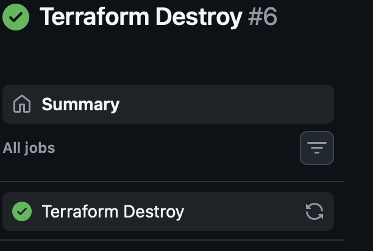

# ECS Gatus Monitoring Stack

A production-style containerised monitoring application deployed on AWS using ECS Fargate, provisioned with Terraform, and delivered through a CI/CD pipeline.

---
## Overview

This project demonstrates a complete end-to-end deployment of a containerised application in AWS.

It includes infrastructure provisioning, container build and deployment, secure networking, and real-time monitoring.

The application is deployed behind an Application Load Balancer, runs in private subnets, and is exposed via a custom domain over HTTPS.

---
## Live Application

The application is deployed and accessible via a custom domain.

Real-time monitoring is implemented using Gatus, providing visibility into uptime, response times, and system health.



---
### HTTPS Validation

The application is served over HTTPS using AWS Certificate Manager.



---
## Key Features

- ECS Fargate deployment (serverless containers)
- Multi-AZ architecture across two Availability Zones
- Private subnet isolation for application tasks
- Application Load Balancer for controlled ingress
- NAT Gateway for outbound internet access
- CI/CD pipeline using GitHub Actions
- Docker image build and push to Amazon ECR
- Infrastructure as Code using Terraform
- Remote Terraform state stored in S3 with locking
- HTTPS enabled via AWS Certificate Manager
- Real-time monitoring with Gatus
- Immutable deployments using commit SHA-based Docker image tagging

---

## Architecture



---

## Architecture Overview

The application is deployed in AWS across two Availability Zones to improve resilience and availability.

User traffic is routed through Route53 to a custom domain, which resolves to an Application Load Balancer. HTTPS is enabled using AWS Certificate Manager.

The load balancer distributes incoming requests to ECS Fargate tasks running in private subnets. These tasks are not directly exposed to the internet, ensuring a secure architecture where all inbound traffic is controlled through the load balancer.

The VPC is split into public and private subnets:

- Public subnets host the Application Load Balancer and NAT Gateway  
- Private subnets host ECS tasks  

Outbound internet access from ECS tasks, such as pulling container images from ECR, is handled via the NAT Gateway. This allows the tasks to communicate externally without being publicly accessible.

The application container is built and pushed to Amazon ECR through a CI/CD pipeline using GitHub Actions. Terraform is used to provision and manage all infrastructure, with remote state stored in S3 for consistency and state locking.

Monitoring is implemented using Gatus, providing real-time visibility into application health, response times, and uptime.

Overall, this architecture follows a production-style design, separating public and private resources, enforcing controlled access, and ensuring high availability across Availability Zones.

## Pipeline Execution

The CI/CD pipelines are fully operational and handle the build, deployment, and teardown of infrastructure.

### Build and Push Pipeline

Builds the Docker image and pushes it to Amazon ECR.



---

### Deploy Pipeline

Runs Terraform to provision and update infrastructure, including ECS services.

Terraform variables are dynamically injected via environment variables in the CI pipeline, including the container image tag and infrastructure configuration.



---

### Destroy Pipeline

Tears down infrastructure when required.



## Project Structure

```text
.
├──app/                       # Gatus application configuration
├── bootstrap/                # Initial infrastructure (e.g. state backend)
├── infra/
│   ├── modules/              # Reusable Terraform modules
│   │   ├── acm/
│   │   ├── alb/
│   │   ├── ecs/
│   │   ├── route53/
│   │   └── vpc/
│   ├── backend.tf            # S3 remote state configuration
│   ├── provider.tf           # AWS provider configuration
│   ├── variables.tf          # Input variables
│   ├── outputs.tf            
│   └── main.tf               # Root infrastructure definition
├── .github/workflows/        # CI/CD pipelines
├── screenshots/              # Architecture diagram and demo assets
├── Dockerfile                # Container build definition
```

## Docker Improvements

The application uses a multi-stage Docker build to ensure the final image only contains what is necessary, reducing image size.

The runtime container is configured to run as a non-root user, following the principle of least privilege and reducing the impact of a potential container compromise.

File ownership is explicitly set to ensure the application has the correct permissions when running as a non-root user.

## Security Considerations

- ECS tasks run in private subnets with no public IP addresses  
- All inbound traffic is routed through the Application Load Balancer  
- Security groups restrict access to ALB → ECS only  
- HTTPS is enforced using AWS Certificate Manager  
- No direct internet access to application containers  

## How to Run This Project

### Prerequisites

- Terraform
- AWS CLI (configured with credentials)

---

### 1. Clone the repository

```bash
git clone https://github.com/Mohamed-Abdullahi1/gatus-ecs-project.git
cd gatus-ecs-project
```

---

### 2. Configure AWS credentials

```bash
aws configure
```

---

### 3. Apply infrastructure

```bash
cd infra
terraform init
terraform apply
```

---

Application builds and deployments are handled automatically through the CI/CD pipeline.