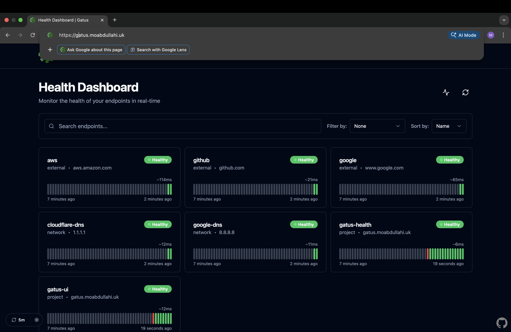

# Gatus Monitoring Dashboard on AWS (ECS Fargate)

## Overview

This project deploys a production-style monitoring dashboard using Gatus on AWS.

The application runs on ECS Fargate inside private subnets and is exposed through an Application Load Balancer. HTTPS is configured using AWS Certificate Manager and the service is accessible via a custom domain.

Infrastructure is provisioned using Terraform and deployments are automated using GitHub Actions.

The goal of this project was to demonstrate how networking, container orchestration, and CI/CD come together in a real system.

---

## Live Application

The application is publicly accessible over HTTPS.



---

## HTTPS Configuration

The application is secured using an ACM certificate and served over HTTPS through the ALB.


---

## Architecture

The system is deployed in a custom VPC across multiple availability zones.

Public subnets host the Application Load Balancer and NAT Gateway.  
Private subnets run ECS Fargate tasks.  

Traffic flow:

- Users access the application via HTTPS  
- Traffic is routed through Route 53 and the ALB  
- ECS tasks handle requests inside private subnets  
- Images are pulled from ECR  
- Logs are sent to CloudWatch  


---

## CI/CD Pipelines

### Build and Push (ECR)

Docker images are built and pushed to Amazon ECR using GitHub Actions.


---

### Terraform Deploy

Infrastructure is deployed and updated automatically.


---

### Terraform Destroy

Infrastructure can be cleanly torn down when needed.


---

## Key Components

### Networking

- Custom VPC with public and private subnets  
- Internet Gateway for inbound access  
- NAT Gateway for outbound traffic from private subnets  
- Route tables controlling traffic flow  

### Compute

- ECS Cluster using Fargate  
- Stateless containerised Gatus service  
- Multi-AZ deployment for availability  

### Load Balancing

- Application Load Balancer  
- HTTPS listener with ACM certificate  
- Target groups routing traffic to ECS tasks  

### Security

- Least privilege security groups  
- ECS tasks only accessible via ALB  
- No direct public exposure of compute layer  

### CI/CD

- GitHub Actions pipelines  
- Automated image build and push  
- Automated infrastructure deployment  

### Observability

- CloudWatch logs  
- ALB health checks  

---

## Infrastructure as Code

All infrastructure is defined using Terraform.

Resources include:

- VPC and subnet configuration  
- ECS cluster and service  
- ALB and target groups  
- IAM roles and policies  
- ACM certificate  

This allows the environment to be reproducible and version controlled.

---

## Deployment Flow

1. Application is containerised using Docker  
2. Image is pushed to Amazon ECR  
3. GitHub Actions pipeline runs  
4. Terraform provisions or updates infrastructure  
5. ECS service deploys updated containers  
6. ALB routes traffic to healthy tasks  

---

## Repository Structure
.
├── .github/
│   └── workflows/        # CI/CD pipelines (build, deploy, destroy)
├── app/                  # Gatus configuration and application files
├── bootstrap/            # Initial setup (remote state, backend, prerequisites)
├── infra/                # Terraform infrastructure (VPC, ECS, ALB, IAM)
├── screenshots/          # Project screenshots for documentation
├── .dockerignore         # Docker build exclusions
├── .gitignore            # Git ignored files
├── Dockerfile            # Container build definition
├── health.go             # Optional health check endpoint 
└── README.md

## Local Setup

### Clone the Repository

```bash
git clone https://github.com/Mohamed-Abdullahi1/gatus-ecs-project.git
cd gatus-ecs-project